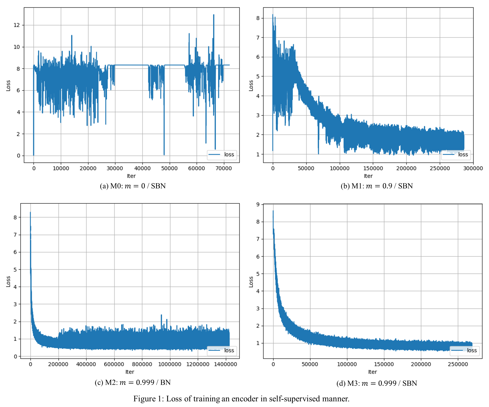
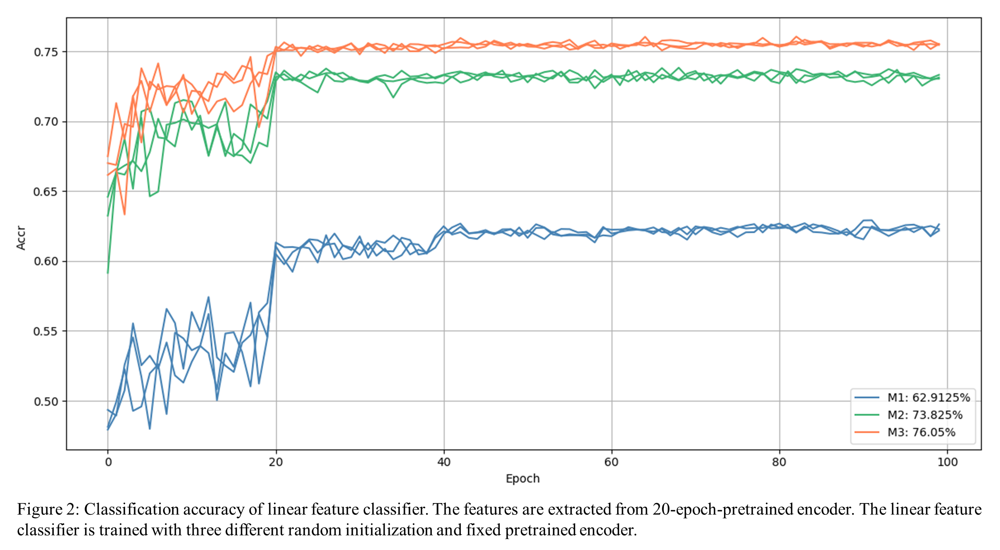
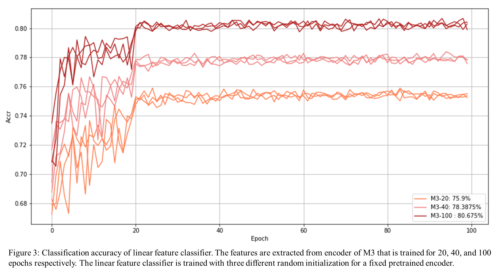

# MoCo: Momentum Contrast for Unsupervised Visual Representation Learning
Unofficial pytorch implementation of __Momentum Contrast for Unsupervised Visual Representation Learning__ ([Paper](https://arxiv.org/abs/1911.05722)).  

## Requirements  
The environment that this repository is created is as follows.  

- Python 3.6.2
- PyTorch 1.4.0
- torchvision 0.5.0
- PIL 7.0.0
- matplotlib 2.0.2
- PyYAML 3.12 (Optional)  
  
Note that torchvision < 0.5.0 does not operate with PIL == 7.0.0 ([link](https://github.com/pytorch/vision/issues/1712)). To use torchvision < 0.5.0, PIL < 7.0.0 is needed.
  
## Dataset  
#### ImageNet  
Download the dataset and untar. It will create subdirectories for each class with images belonging to that class.   
``` 
cd YOUR_ROOT  
wget http://www.image-net.org/challenges/LSVRC/2012/nnoupb/ILSVRC2012_img_train.tar  
tar xvf ILSVRC2012_img_train.tar  
```  
As a result, the subdirectories for training dataset will be located in ```YOUR_ROOT/ILSVRC/Data/CLS-LOC/train```.

#### STL-10  
One can download this dataset from [here](http://ai.stanford.edu/~acoates/stl10/), or just use [torchvision](https://pytorch.org/docs/stable/torchvision/datasets.html). This repository handles STL-10 dataset via torchvision. Please check ```dataloader.py``` for details.

## Hardware  
All results in this repository are produced with __6 NVIDIA TITAN Xp GPUs__. To produce the best performance, multi-gpu is necessary.
  
## Training  
You can train Resnet-50 encoder in self-supervised manner with ImageNet dataset by running the command below.
```bash
CUDA_VISIBLE_DEVICES=0,1,2,3,4,5 python train.py --dataset_root=YOUR_ROOT/ILSVRC/Data/CLS-LOC/train --shuffle_bn 
```
The training output such as loss graph and weight of the encoder will be saved in ```MoCo/output/IMAGENET-64/v1```. You can change this location by changing the arguments ```--output_root```, ```--dataset_name```, and ```--exp_version```.

## Test  
If you train the model by running the command above, you can evaluate the pretrained encoder with STL-10 dataset by running the command below. You can designate the checkpoint to load with `--load_pretrained_epoch`.    
```bash
CUDA_VISIBLE_DEVICES=0 python test.py --dataset_root=YOUR_ROOT/STL-10 --load_pretrained_epoch=100
```
This command will train a linear feature classifier that takes the feature vectors from pretrained encoder as inputs with STL-10 dataset. After training a linear feature classifier, it will calculate a classifcation accuracy and plot a graph. If you train the encoder by running the command above without changing anything, this command will automatically load pretrained weight from ```MoCo/output/IMAGENET-64/v1``` and save the test results including loss graph, accuracy graph, and weight of a linear classifier in ```MoCo/output/IMAGENET-64/v1/eval```. If you changed any arguments among ```--output_root```, ```--dataset_name```, and ```--exp_version``` when training, you should consistently change ```--encoder_output_root```, ```encoder_dataset_name```, and ```encoder_exp_version``` when testing.

## Experimental results
The results below show the effectiveness of main contributions of this paper, but the performance can be improved by careful consideration on data augmentation manner, increasing number of keys, or changing the backbone model.  

#### Models
Results are produced with four models. Each model has difference with other models on __momentum value (_m_)__ and whether to use __shuffled batch norm__ (SBN) or not (BN). Descriptions below show each setting with training command.  

- __M0__: _m_ = 0 / SBN
```bash
CUDA_VISIBLE_DEVICES=0,1,2,3,4,5 python train.py --dataset_root=YOUR_ROOT/ILSVRC/Data/CLS-LOC/train --exp_version=M0 --momentum=0 --shuffle_bn
```  
- __M1__: _m_ = 0.9 / SBN
```bash
CUDA_VISIBLE_DEVICES=0,1,2,3,4,5 python train.py --dataset_root=YOUR_ROOT/ILSVRC/Data/CLS-LOC/train --exp_version=M1 --momentum=0.9 --shuffle_bn
```  
- __M2__: _m_ = 0.999 / BN
```bash
CUDA_VISIBLE_DEVICES=0,1,2,3,4,5 python train.py --dataset_root=YOUR_ROOT/ILSVRC/Data/CLS-LOC/train --exp_version=M2 --momentum=0.999  
```  
- __M3__: _m_ = 0.999 / SBN
```bash
CUDA_VISIBLE_DEVICES=0,1,2,3,4,5 python train.py --dataset_root=YOUR_ROOT/ILSVRC/Data/CLS-LOC/train --exp_version=M3 --momentum=0.999 --shuffle_bn 
```  

#### Expectations  
- __M0__ will not converge because it does not have momentum. The training loss will oscillate. Check _Ablation: momentum_ in _Section.4.1_.  
- __M1__ will converge but __M3__ will have higher classifcation accuracy than __M1__ because of __more consistent dictionary__ due to a higher momentum value. Check _Ablation: momentum_ in _Section.4.1_.  
- __M3__ will have higher classifcation accuracy than __M2__ because of __shuffled batch norm__. Check _shuffling BN_ in _Section 3.3_.  

#### Results
<p align="center"></p>  

- In Fig. 1a, __M0__ does not converge. It shows the importance of consistent dictionary in convergence. Although shuffled batch norm is used, the model cannot converge without consistent dictionary. __M0__ is early stopped because it does not seem to converge.  
- In Fig. 1b and 1d, __M3__ is trained more stably than __M1__. It shows the importance of consistent dictionary.  
- In Fig. 1c and 1d, __M2__ converges, but __M3__ converges better than __M2__ with lower loss value. Note that Fig. 1c has 1400K iterations and Fig. 1d has 250K iterations on x axis. Although __M3__ is trained for less iterations, it converges better than __M2__.
- Therefore, Fig. 1 shows that the consistent dictionary is the core of training. Shuffled batch norm can improve the training, but it is not the core.
  
<p align="center"></p>  
  
After you train __M1__, __M2__, and __M3__ by running commands above, you can plot graph in Fig. 2 by running  
```bash
CUDA_VISIBLE_DEVICES=0 python visualize.py --dataset_root=YOUR_ROOT/STL-10 --multiple_encoder_exp_version M1 M2 M3
```
  
- __M0__ is excluded becuase it does not converge.
- __M2__ records much higher classifcation accuracy than __M1__. Note that the only one difference between __M1__ and __M2__ is _m_. It shows the importance of consistent dictionary.  
- __M3__ records higher classification accuracy than __M2__, but the gap between __M3__ and __M2__ is not as large as that between __M2__ and __M1__. Furthermore, the model does not converge without momentum as shown by __M0__. Therefore, we can notice that the consistent dictionary is necessary and shuffled batch norm can improve the performance.

<p align="center"></p>  

- Fig. 3 shows the feature classifcation accuracy with pretrained encoder of M3. It includes several graphs according to epochs that are spent to train M3. The training is done at 50% and still in progress. Currently, M3-100 (train M3 for 100 epochs) shows the best performance.
