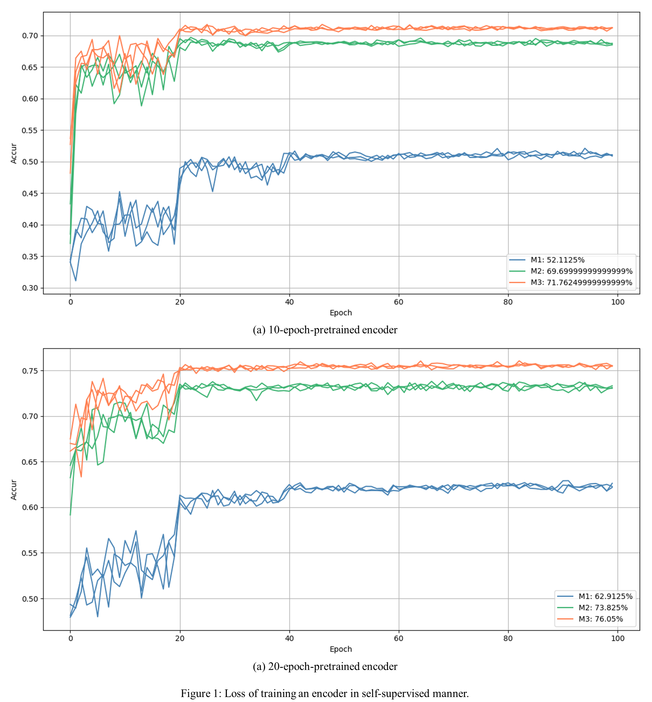

# MoCo: Momentum Contrast for Unsupervised Visual Representation Learning
Unofficial pytorch implementation of __Momentum Contrast for Unsupervised Visual Representation Learning__ ([Paper](https://arxiv.org/abs/1911.05722)).  

## Requirements  
- PyTorch 1.4.0
- torchvision 0.5.0
- PIL 7.0.0
- matplotlib 2.0.2
- PyYAML 3.12 (Optional)  

## Dataset  
#### ImageNet  
Download the dataset and untar. It will create subdirectories for each class with images belonging to that class.   
``` 
cd YOUR_ROOT  
wget http://www.image-net.org/challenges/LSVRC/2012/nnoupb/ILSVRC2012_img_train.tar  
tar xvf ILSVRC2012_img_train.tar  
```  
As a result, the subdirectories for training dataset will be located in ```YOUR_ROOT/ILSVRC/Data/CLS-LOC/train```.

#### STL-10  
One can download this dataset from [here](http://ai.stanford.edu/~acoates/stl10/), or just use [torchvision](https://pytorch.org/docs/stable/torchvision/datasets.html). This repository handles STL-10 dataset via torchvision. Please check ```dataloader.py``` for details.

## Hardware  
All results in this repository are produced with __6 NVIDIA TITAN Xp GPUs__. To produce the best performance, multi-gpu is necessary.
  
## Training  
You can train Resnet-50 encoder in self-supervised manner with ImageNet dataset by running the command below.
```bash
CUDA_VISIBLE_DEVICES=0,1,2,3,4,5 python train.py --dataset_root=YOUR_ROOT/ILSVRC/Data/CLS-LOC/train --shuffle_bn --save_config 
```
The training output such as loss graph and weight of the encoder will be saved in ```MoCo/output/IMAGENET-64/v1```. You can change this location by changing the arguments ```--output_root```, ```--dataset_name```, and ```--exp_version```.

## Test  
You can evaluate the pretrained encoder with STL-10 dataset by running the command below.
```bash
CUDA_VISIBLE_DEVICES=0 python test.py --dataset_root=YOUR_ROOT/STL-10 --load_pretrained_epoch=100
```
This command will train a linear feature classifier that takes the feature vectors from pretrained encoder as inputs with STL-10 dataset. If you train the encoder by running the command above without changing anything, this command will automatically load pretrained weight from ```MoCo/output/IMAGENET-64/v1```. If you changed any arguments among ```--output_root```, ```--dataset_name```, and ```--exp_version``` when training, you should consistently change ```--encoder_output_root```, ```encoder_dataset_name```, and ```encoder_exp_version``` when testing.

## Experimental results
This repository shows the effectiveness of main contributions, but the performance can be improved by careful consideration on data augmentation manner, or increasing training epoch, number of keys, and size of images.  

#### Models
Results are produced with four models. Each model has difference with other models on __momentum value (_m_)__ and whether to use __shuffled batch norm__ (SBN) or not (BN). Descriptions below show each setting with training command.  

- __M0__: _m_ = 0 / SBN
```bash
CUDA_VISIBLE_DEVICES=0,1,2,3,4,5 python train.py --dataset_root=YOUR_ROOT/ILSVRC/Data/CLS-LOC/train --momentum=0 --shuffle_bn --save_config 
```  
- __M1__: _m_ = 0.9 / SBN
```bash
CUDA_VISIBLE_DEVICES=0,1,2,3,4,5 python train.py --dataset_root=YOUR_ROOT/ILSVRC/Data/CLS-LOC/train --momentum=0.9 --shuffle_bn --save_config 
```  
- __M2__: _m_ = 0.999 / BN
```bash
CUDA_VISIBLE_DEVICES=0,1,2,3,4,5 python train.py --dataset_root=YOUR_ROOT/ILSVRC/Data/CLS-LOC/train --momentum=0.999 --save_config 
```  
- __M3__: _m_ = 0.999 / SBN
```bash
CUDA_VISIBLE_DEVICES=0,1,2,3,4,5 python train.py --dataset_root=YOUR_ROOT/ILSVRC/Data/CLS-LOC/train --momentum=0.999 --shuffle_bn --save_config 
```  

#### Expectations  
- __M0__ will not be converged because it does not have momentum. The training loss will oscillate. Check _Ablation: momentum_ in _Section.4.1_.  
- __M1__ will be converged but __M3__ will have higher classifcation accuracy than __M1__ because of more consistent dictionary due to a higher momentum value. Check _Ablation: momentum_ in _Section.4.1_.  
- __M3__ will have higher classifcation accuracy than __M2__ because of shuffled batch norm. Check _shuffling BN_ in _Section 3.3_.  

#### Results
<p align="center"></p>  

- In Fig. 1a, __M0__ is not converged. It shows the importance of momentum encoder. Note that __M0__ is early stopped because it does not seem to be converged.  
- In Fig. 1b and 1d, __M3__ is trained more stably than __M1__. It shows the importance of momentum encoder.  
- In Fig. 1c and 1d, __M2__ is converged, but __M3__ is converged better than __M2__ with lower loss value.
- Therefore, Fig. 1 shows that the consistency of dictionary due to the momentum is the core of training. Shuffled batch norm can improve the training, but it is not the core.
  
<p align="center"></p>  
